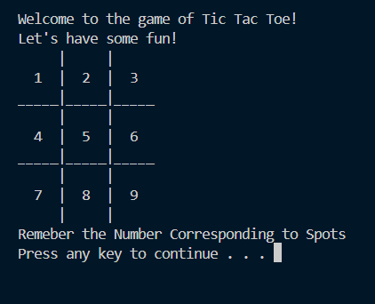
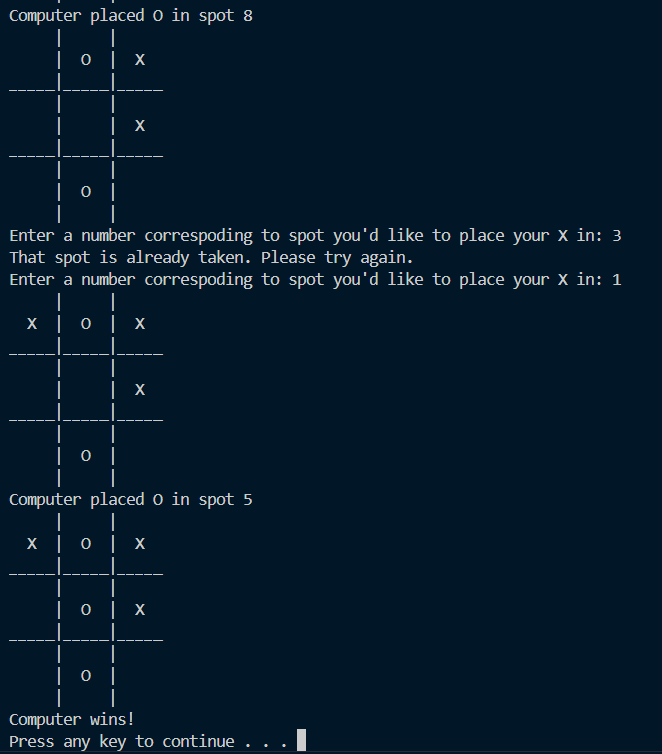

# Terminal Tic Tac Toe Using CPP
 

- It's a beginner-level CPP project that I built to test my C++ skills.
- It runs on your Terminal, where you play against the computer
- You get to choose whether you want to play as X or O

